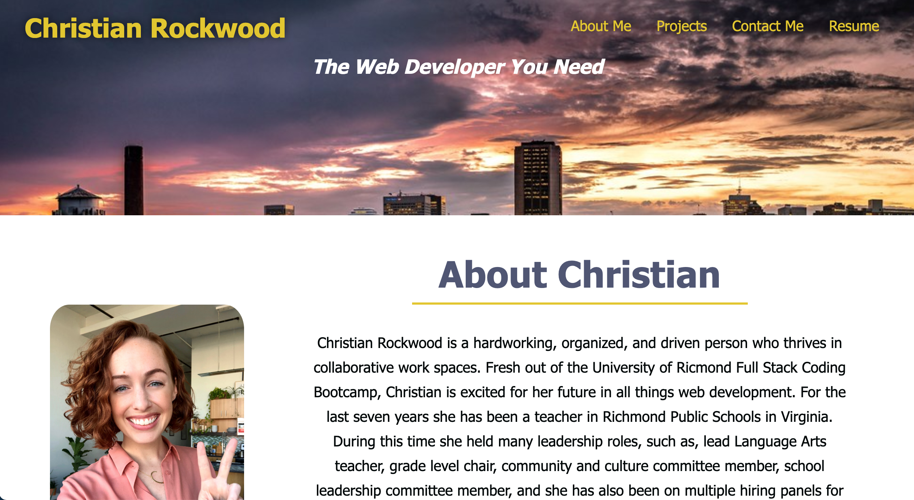

# Portfolio-ChristianRockwood
## By Christian Rockwood

This web page is my second challenge for University of Richmond's Coding Boot Camp.
In this assignment I created a digital portfolio that I will continue to update throughout this course. This portfolio is what I will use when applying to jobs. This portfolio was created using HTLML and advanced CSS, including pseudo elements.

[Link to deployed application](https://rockwoodc.github.io/Portfolio-ChristianRockwood/)